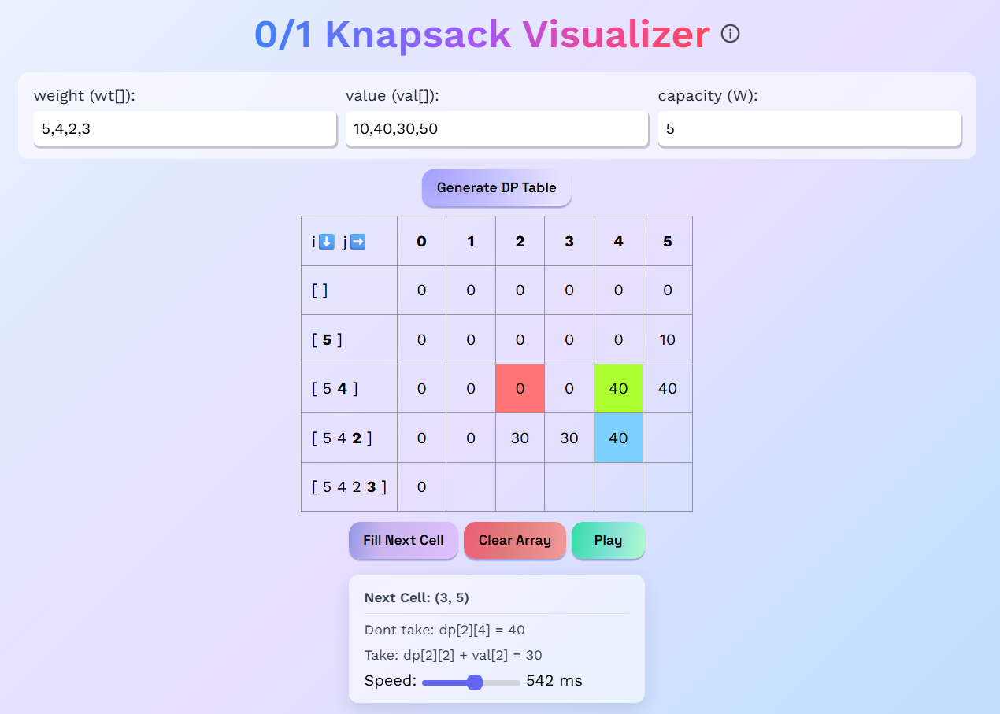

## 0/1 Knapsack Visualizer

An interactive visualizer to understand how 0/1 Knapsack problem in Dynamic Programming by filling the DP table cell by cell.

<p align="center">
    
</p>

---

### What is the 0/1 Knapsack Problem?

The **0/1 Knapsack problem** is an optimization problem in Dynamic Programming, where we have:
- **weight** array `wt[]`
- **value** array `val[]`
- and a knapsack with **capacity** `W`

Each item can either be **taken (1)** OR **not taken (0)**

The goal is to **maximize the total value** without exceeding the capacity of the knapsack.

---

### Dynamic Programming Approach

We use a DP table where:

```
dp[i][j] = maximum value using first `i` items with capacity `j`
```

At each cell, we can either:
- **Take the item (if capacity allows)**
- **Dont take the item**

This visualizer highlights these decisions interactively.

---

### How to Use the Visualizer

- Enter the **weight array**, **value array**, and **capacity**
- Generate the DP table, and use these options:
  - **Fill Next Cell**  step-by-step execution
  - **Play / Pause** – automatic filling
  - **Speed Slider** – control filling animation speed
- At each cell, observe:
  - 🟦 Blue cell -> current cell whose value is being computed
  - 🟩 Green cell -> considered✅ (MAX of take and donttake)
  - 🟥 Red cell -> rejected❌ (not MAX of take and donttake)

---

### Practice 0/1 Knapsack Problems

Here are a few practice problems based on 0/1 Knapsack:

- [0/1 Knapsack Problem (GeeksForGeeks)](https://www.geeksforgeeks.org/problems/0-1-knapsack-problem0945/1)
- [Subset Sum Problem (GeeksForGeeks)](https://www.geeksforgeeks.org/problems/subset-sum-problem-1611555638/1)

- [Partition Equal Subset Sum (Leetcode)](https://leetcode.com/problems/partition-equal-subset-sum/description)
- [Target Sum (Leetcode)](https://leetcode.com/problems/target-sum/description)
- [Coin Change (Leetcode)](https://leetcode.com/problems/coin-change/description)
- [Coin Change II (Leetcode)](https://leetcode.com/problems/coin-change-ii/description)
- [Best Time to Buy and Sell Stock V (Leetcode)](https://leetcode.com/problems/best-time-to-buy-and-sell-stock-v/description/)

- [Knapsack 1 (AtCoder)](https://atcoder.jp/contests/dp/tasks/dp_d)
- [Knapsack 2 (AtCoder)](https://atcoder.jp/contests/dp/tasks/dp_e)

- [Sherlock and Cost (Hackerrank)](https://www.hackerrank.com/challenges/sherlock-and-cost/problem)

Furthermore, you may refer [knapsack article on cp-algorithms](https://cp-algorithms.com/dynamic_programming/knapsack.html#0-1-knapsack)

---

### Contact

If you have feedback or suggestions, feel free to connect on [LinkedIn](https://www.linkedin.com/in/aaryaveer-rajput/)